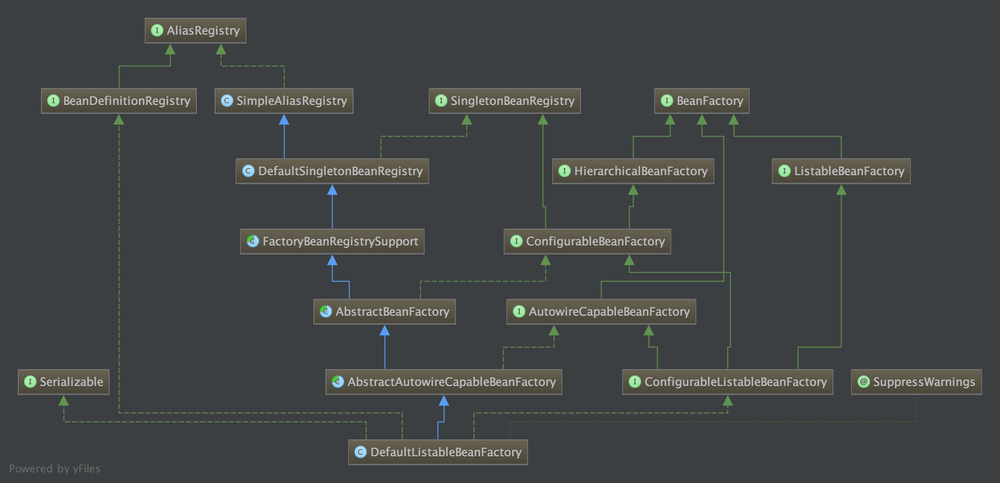

`1.核心类`  
    1.xmlBeanFactory extends DefaultListableBeanFactory    
    2.AliasRegistry：定义对alias（别名）的简单增删改查等操作  
    3.SimpleAliasRegistry：主要使用map作为alias的缓存，并对接口AliasRegistry进行实现  
    4.SingletonBeanRegistry：定义对单例的注册和获取  
    5.BeanFactory：定义获取bean及bean的各种属性  
    6.DefaultSingletonBeanRegistry：对接口SingletonBeanRegistry各函数的实现  
    7.FactoryBeanRegistrySupport：在DefaultSingletonBeanRegistry基础上增加对FactoryBean的特殊处理  
    8.HierarchicalBeanFactory:继承BeanFactory，也就是在BeanFactory定义的功能的基础上增加了对parentFactory的支持  
    9.ConfigurableBeanFactory：提供配置Factory的各种方法  
    10.ListableBeanFactory：根据各种条件获取bean的配置清单  
    11.AbstractBeanFactory：综合FactoryBeanRegistrySupport和ConfigurableBeanFactory的功能  
    12.AutoWireCapableBeanFactory：提供创建bean，自动注入，初始化以及应用bean的后处理器  
    13.AbstractAutoWireCapableBeanFactory：综合AbstractBeanFactory并对接口AutoWireCapableBeanFactory进行实现  
    14.ConfigurableListableBeanFactory：BeanFactory配置清单，指定忽略类型和接口等  
    15.DefaultListableBeanFactory：综合上面所有功能，主要是对bean注册后的处理  

xmlBeanDefinition